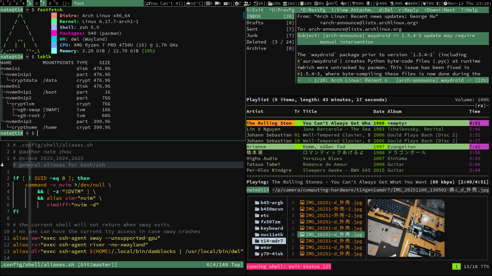

#  My build of [dwl](https://codeberg.org/dwl/dwl) - dwm for Wayland



dwl 0.8

### Running dwl
```sh
alias dl="exec ssh-agent ${HOME}/.local/bin/damblocks | /usr/local/bin/dwl"
```

### Status information
I'm using the bar patch with `damblocks`([codeberg](https://codeberg.org/unixchad/damblocks)/[github](https://github.com/gnuunixchad/damblocks)), my modular POSIX script with signaling support.

For a build without the `bar.patch`, checkout the `nobar` branch. You can use any compatible bar.


### Patches applied
1. [bar](https://codeberg.org/dwl/dwl-patches/patch/bar/bar.patch)
2. [autostart](https://codeberg.org/dwl/dwl-patches/patch/autostart/autostart-0.8.patch)
3. [sticky](https://codeberg.org/dwl/dwl-patches/patch/sticky/sticky.patch)
4. [pertag](https://codeberg.org/dwl/dwl-patches/patch/pertag/pertag.patch)
5. [swapandfocusdir](https://codeberg.org/dwl/dwl-patches/patch/swapandfocusdir/swapandfocusdir.patch)
6. [genericgaps](https://codeberg.org/dwl/dwl-patches/patch/genericgaps/genericgaps.patch)
7. [alwayscenter](https://codeberg.org/dwl/dwl-patches/patch/alwayscenter/alwayscenter.patch)
8. [text-input](https://codeberg.org/dwl/dwl-patches/patch/text-input/text-input-0.8.patch)
9. [bottomstack](https://codeberg.org/dwl/dwl-patches/patch/bottomstack/bottomstack-0.8.patch)
10. [decklayout](https://codeberg.org/dwl/dwl-patches/patch/decklayout/decklayout-0.8.patch)


### known issues
- footclient window flickering, see [dwl#705](https://codeberg.org/dwl/dwl/issues/705)


### Building dwl 0.8
dwl has the following dependencies:
- libinput
- wayland
- wlroots0.18 (compiled with the libinput backend)
- xkbcommon
- wayland-protocols (compile-time only)
- pkg-config (compile-time only)

dwl has the following additional dependencies if XWayland support is enabled:
- libxcb
- libxcb-wm
- wlroots (compiled with X11 support)
- Xwayland (runtime only)

Install these (and their `-devel` versions if your distro has separate
development packages) and run `make`. If you wish to build against a released
version of wlroots (*you probably do*), use a [release] or a [0.x branch]. If
you want to use the unstable development `main` branch, you need to use the git
version of [wlroots].

To enable XWayland, you should uncomment its flags in `config.mk`.
